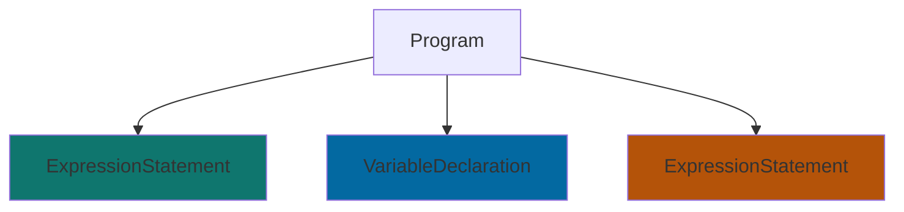
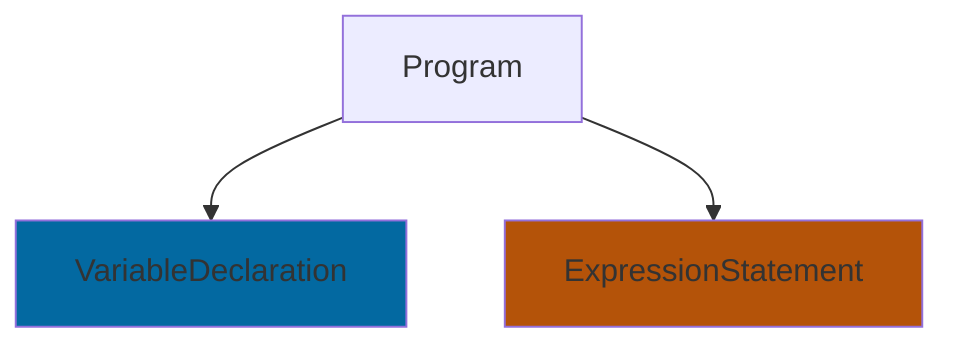

Today, we'll learn how to handle uncommon problems in everyday work. We'll explore solutions step by step, starting from basic problem-solving approaches to out-of-the-box solutions. Sometimes we might have limited options because, in reality, our world is often more complex than we imagine. But regardless of the reason, let's find ways to solve it.

> If you notice that the topic title isn't mentioned much while reading, don't be surprised. The key point of this article isn't about the title, but rather the problem-solving concepts we'll present.

## Problem
When working with poorly designed code, such as unrelated code being coupled together, it makes code reusability difficult.

```js file-a.js
// Assumed to be setting up something important but unrelated
// !callout[/injectedVariable/] This line runs when require/import even though it's not needed
// !mark
console.log(injectedVariable)

// !mark(1:3)
const obj = {
  field: 'interesting value'
// !callout[/}/] Value we want to use elsewhere
}

module.exports = obj 
```

When using `file-a.js` in other files, we need to set up various values before they can be used, like:

```js file-b.js
// !mark
// !callout[/injectedVariable/] setup to be able to call file-a.js
global.injectedVariable = "Injected Utils, Helpers, ..."

const obj = require('./file-a.js')
console.log(obj.field)
```

Problems we'll encounter, like writing tests for `file-a.js` without setup because it's not related to the test
```js file-a.test.js
// !mark
// !callout[/require/] !error ReferenceError: injectedVariable is not defined
const obj = require('./file-a.js')

test('correct value', () => {
  expect(obj.field).toBe('interesting value')
})
```

When running `file-a.test.js`, we'll get an error because we didn't set up `injectedVariable` first, even though the `obj.field` value we need doesn't depend on `injectedVariable`

## Solutions

When encountering this situation, some might notice this code lacks proper Separation of Concerns (SoC). This happen when unrelated code is forced to run together instead of running independently.

### Refactor
If we can refactor the code, we might change it to:

```js file-a.js
// !mark(1:4)
// !diff(1:2) +
const setup = () => {
  // Assumed to be setting up something important but unrelated
  // !bg[1:2] !+
  console.log(injectedVariable)
// !callout[/}/] Wrap in function to control when it runs
// !diff +
}

const obj = {
  field: 'interesting value'
}

// !bg[/setup/]
// !callout[/setup/] export to let the importing file choose when to run
module.exports = { setup, obj }
```

```js file-b.js
global.injectedVariable = "Injected Utils, Helpers, ..."

const { setup, obj } = require('./file-a.js')
// !diff +
// !callout[/setup/] Files that need it can call setup
setup()
console.log(obj.field)
```

```js file-a.test.js
// !callout[/obj/] Files that don't need it don't have to call setup
const { obj } = require('./file-a.js')

test('correct value', () => {
  expect(obj.field).toBe('interesting value')
})
```

Just like that, our code has better separation of concerns and can run tests. 

If you think this code can be written better, try it as homework. Because this isn't our goal today.

### When Refactor isn't an option
Let me share another perspective. What if refactoring is not an option we have, perhaps because: 
- We have 100 files like `file-a.js` 
- `file-b.js` is our core code structure that serves as foundation for hundreds of files 
- Almost no tests written - Legacy code with no subject matter experts 
- Boss won't allow changes for some reasons ¯\\\_(ツ)_/¯

We can't just refactor to access `obj.field` because we don't know the full impact, which parts will break, or even who will help us fix hundreds of files and approve our PR.

Anyone facing this situation encounters the chicken-and-egg problem - wanting to refactor first but lacking test coverage, yet needing to refactor before writing more tests.


Generated by DALL·E 3. Prompt "A realistically rendered image displaying the philosophical conundrum known as the 'chicken and egg' problem."

So let's step back. Our current goal is to extract `obj.field`. Besides importing normally like regular programming, what other approaches can we take?
#### Regex

Wouldn't it be nice if we could mimic human behavior - open VS Code, `cmd+f` search for `"field"`, select the value in `""` after `:`, then `cmd+c`? 🤔 

Why not? We have Regex. Let's write some quick code:

```js extract-text-with-regex.js
const fs = require('fs')

// !callout[/readFileSync/] Read file-a.js as plain text
const codeAsText = fs.readFileSync('./file-a.js', { encoding: 'utf-8' })
// !callout[/'"/] Use regex to find desired pattern
// !bg[15:38]
const regex = /field:\s*['"](.*?)['"]/;
const match = input.match(regex);
const output = match[1]

// !callout[/output/] Get desired result
// !bg[/output/]
// !bg[/interesting value/]
console.log(output); // Output: interesting value
```

EZ? If our code isn't complex or follows standards, this could be a quick and effective method. But when our code can be written in various ways like:

```js
const obj = {
  field: 
  // !mark
  // !callout[/interesting value/] new lines
    'interesting value'
}
```

```js
const obj = {
// !callout[/d :/] extra white space and didn't run prettier
// !bg[8:8]
  field : 'interesting value'
}
```

These codes run like the original, but writing regex to cover all cases wouldn't be easy or practical since comprehensive regex could become too hard to read. So we'll stop here with regex.

#### Abstract Syntax Tree (AST)
If we can't run the code directly, and reading as plain text is too complex for the time invested since we'd basically be writing our own parser from scratch, what middle ground options do we have?

Today I'm introducing **AST**. It might sound scary at first, which is true, but understanding just a little lets us use it effectively.

The cool thing is that instead of dealing with a wall of text, we can handle code in chunks related by their function. Each chunk becomes a Node by type - like code that runs a function without storing the result becomes an **Expression Statement**, while variable declarations become **Variable Declaration** nodes. We don't need to worry about whether lines end with semicolons or handle different syntaxes that produce the same result - we can focus on the functionality instead.

For example, in `file-a.js`, when run through a parser it can be divided into 3 main chunks:

<CodeWithMermaid>
```js file-a.js
// !mark #0f766e
console.log(injectedVariable)

// !mark(1:3) #0369a1
const obj = {
  field: 'interesting value'
}

// !mark #b45309
module.exports = obj 
```


</CodeWithMermaid>

From here, we have 2 main options:
1. Extract `obj.field` by traversing object AST nodes - similar to regex but using programming language
2. Remove unused code and keep remaining parts to run as normal code

Neither approach is wrong - just choose what fits the situation.

For today, we'll take approach #2 - removing unwanted code and running what remains.

Our mental model now is wanting this result:

<CodeWithMermaid>
```js modified-file-a.js
// !diff(1:2) -
console.log(injectedVariable)

const obj = {
  field: 'interesting value'
}

module.exports = obj 
```


</CodeWithMermaid>


To write code achieving this, we'll follow these steps:

```js custom-extractor-script.js
// !callout[/acorn/] lib for converting code to ast
const { parse } = require('acorn')
// !callout[27:37] lib for converting ast back to code
const escodegen = require('escodegen')
// !callout[/transformAST/] assume this is function handling ast to get desired result
const transformAST = requrie('./transformAST')
// !callout[/codeAsText/] read code as string
const codeAsText = fs.readFileSync('./file-a.js', { encoding: 'utf-8' })
// !callout[/ast/] convert code to ast
const ast = parse(codeAsText)
// !callout[/transformedAST/] transform ast by removing/modifying as needed, in this case removing line 1
const transformedAST = transformAST(ast)
// !callout[/transformedCodeAsText/] convert ast back to code
const transformedCodeAsText = escodegen.generate(transformedAST)
// !callout[/eval/] run modified code like using require/import with eval
const obj = eval(transformedCodeAsText)
// !callout[/log/] PRINT: interesting value
console.log(obj.field)
```

With this, we have a script like `modified-file-a.js` that can run without modifying or destroying original code.

>Simple Example of _js`transformAST(ast)`_
>```js @collapse transformAST.js
>const transformAST = (ast) => {
>  ast.body.splice(0, 1)
>  return ast
>}
>
>module.exports = transformAST
>```

## Usage Example
For those wondering where the **OpenAPI Spec Generator** went, we saved it as a more complex example of today's problem.

Let's see why this code is difficult to use elsewhere:

```js router.js
// !callout[/application/] !error application is injected, which isn't required but prevent generating API Schema
// !diff -
const { controller } = application
const { z } = require('zod')

const getPet = {
  // !mark(1:7) #60a5fa
  method: 'GET',
  path: '/pet/:petID',
  validation: {
    param: {
      petID: z.string().uuid(),
    }
    // !callout[/},/] !info Context for Gen API Schema
  },
  // !callout[/controller/] !error Not required but prevent generating API Schema
  // !diff -
  controller: controller.getPet
}

const addPet = {
// !mark(1:9) #60a5fa
  method: 'POST',
  path: '/pet',
  validation: {
    body: {
      petID: z.string().uuid().optional(),
      name: z.string().uuid(),
      status: z.enum(["available", "pending", "sold"]).optional(),
    }
    // !callout[/},/] !info Context for Gen API Schema
  },
  // !callout[/controller/] !error Not required but prevent generating API Schema
  // !diff -
  controller: controller.addPet
}

module.exports = [getPet, addPet]
```

From the code, we can see several lines preventing us from easily `require/import` this file.

To use it, we apply the same approach as before, modifying `custom-extractor-script.js` especially the _js`transformAST(ast)`_ function to remove unused nodes.

When successful, we should get this result:

```js router.js
const { z } = require('zod')

const getPet = {
  method: 'GET',
  path: '/pet/:petID',
  validation: {
    param: {
      petID: z.string().uuid(),
    }
  },
}

const addPet = {
  method: 'POST',
  path: '/pet',
  validation: {
    body: {
      petID: z.string().uuid().optional(),
      name: z.string().uuid(),
      status: z.enum(["available", "pending", "sold"]).optional(),
    }
  },
}

module.exports = [getPet, addPet]
```

After running `eval/import/require` with our newly created code, we can use these values to generate OpenAPI Specification. Yay!

## Conclusion
This article might not be friendly for everyone, but hopefully it opens up new perspectives on handling code in different situations - whether viewing code as regular code, text, or as node and tree structures. By keeping an open mind to new perspectives, we can handle challenging problems without them being out of reach.

See you in the next article~
