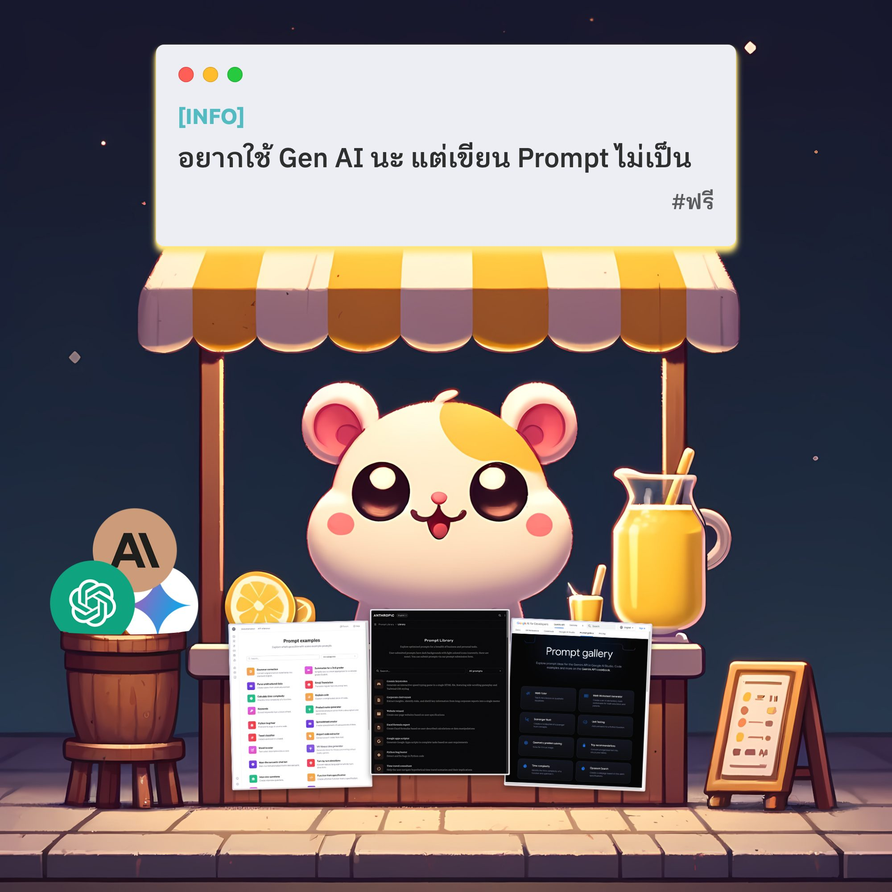

หลายคนน่าจะเจอปัญหาว่า พยายามลองใช้ Generative AI แล้ว แต่สุดท้ายถามอะไรไปก็ตอบไม่ได้ อยากใช้ให้เป็น แต่ก็ไปไม่ถูก สงสัยคงต้องลงเรียนคอร์ส 🤔

แต่ช้าก่อน ✋ จริงๆแล้วคุณเพียงอยากได้เห็นตัวอย่างดีๆ ที่เขียน Prompt ออกมาแล้วเวิร์ค ได้คำตอบดังที่ต้องการ 💡 เช่นนั้นแล้ว วันนี้เลยรวมแหล่งตัวอย่างดีๆ จากต้นทางของผู้พัฒนาเอง 👨‍💻 เพราะใครจะไปรู้ดีกว่าผู้สร้างละ ลองเข้าไปดูได้ในลิงค์ข้างล่างเลย

🌟 OpenAI - ChatGPT

🔗 [https://platform.openai.com/examples](https://platform.openai.com/examples)

🌟 Anthropic - Claude 🔗 [https://docs.anthropic.com/en/prompt-library/library](https://docs.anthropic.com/en/prompt-library/library)

🌟 Google - Gemini 🔗 [https://ai.google.dev/gemini-api/prompts](https://ai.google.dev/gemini-api/prompts)

ส่วนใครอยากลงลึกไปกว่านั้น อยากเขียน Prompt ที่สามารถบังคับทิศทางของคำตอบได้ละเอียด อยากลองเป็น Prompt Engineering ทางผู้พัฒนาเอง 👨‍💻 ก็ได้รวบรวม Guideline และคำแนะนำดีๆ ที่เพียงปรับเล็กน้อยก็เพิ่มโอกาสความถูกต้องของคำตอบได้มาก 🎯 เราก็ได้รวมลิงค์ไว้ข้างล่างเช่นกัน

🔹 OpenAI 🔗 [https://platform.openai.com/docs/guides/prompt-engineering](https://platform.openai.com/docs/guides/prompt-engineering)

🔹 Anthropic 🔗 [https://docs.anthropic.com/en/docs/prompt-engineering](https://docs.anthropic.com/en/docs/prompt-engineering)

🔹 Google 🔗 [https://ai.google.dev/gemini-api/docs/prompting-strategies](https://ai.google.dev/gemini-api/docs/prompting-strategies)

ใครมี Use Case อะไรที่อยากมา Challenge ตัว Gen AI ทั้งหลาย แต่เขียน Prompt ไม่ถูก ลองส่งมาแชร์กันได้เลยนะ ไว้เจอกันใหม่ในโพสหน้า 👋