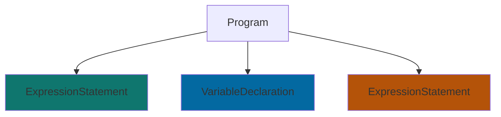
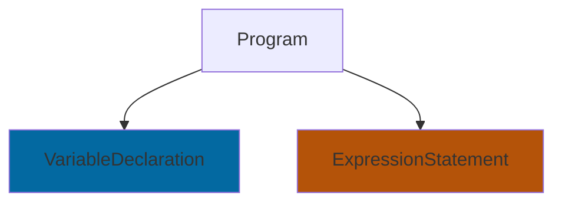

วันนี้เราจะพาไปเรียนรู้วิธีรับมือกับปัญหาที่ไม่ค่อยพบเจอในการทำงานทั่วไป โดยจะค่อยๆหาทางออกไปทีละขั้น เริ่มจากวิธีแก้ปัญหาพื้นฐานทั่วไป ไปจนถึงแนวทางที่ออกนอกกรอบ ซึ่งบางครั้งอาจมีทางเลือกไม่มากนัก เพราะความเป็นจริงแล้ว โลกของเรามักซับซ้อนกว่าที่คาดคิด แต่ไม่ว่าจะด้วยเหตุผลใด เราไปหาทางแก้ไขมันกัน 

> หากอ่านไป แล้วสังเกตว่าชื่อหัวข้อไม่ค่อยถูกกล่าวถึง ก็ไม่ต้องแปลกใจ เพราะจุดสำคัญของบทความนี้ไม่ได้อยู่ที่ชื่อหัวข้อ แต่อยู่ที่แนวคิดในการแก้ปัญหาที่จะนำเสนอ

## ปัญหา
เวลาทำงานกับโค๊ดออกแบบมาไม่ดี เช่นโค๊ดที่ไม่ได้เกี่ยวข้องกันถูกผูกเข้าด้วยกัน ทำให้การนำโค้ดกลับมาใช้ซ้ำทำได้ยาก

```js file-a.js
// Assumed to be setting up something important but unrelated
// !callout[/injectedVariable/] บรรทัดนี้ ถึงแม้ไม่ได้ต้องการใช้งาน ก็ถูกรันเมื่อมีการ require/import 
// !mark
console.log(injectedVariable)

// !mark(1:3)
const obj = {
  field: 'interesting value'
// !callout[/}/] ค่าที่อยากนำไปใช้ที่อื่น
}

module.exports = obj 
```

เวลาจะนำ `file-a.js` มาใช้ที่ไฟล์อื่น ก็ต้อง setup ค่าต่างๆ ก่อนจะนำค่าเหล่านั้นมาใช้การได้ เช่น

```js file-b.js
// !mark
// !callout[/injectedVariable/] setup เพื่อให้เรียก file-a.js ได้
global.injectedVariable = "Injected Utils, Helpers, ..."

const obj = require('./file-a.js')
console.log(obj.field)
```

ปัญหาที่เราจะเจอ อย่างเช่นเขียน test ให้ `file-a.js` แล้วไม่ได้ setup เพราะไม่ได้มีส่วนเกี่ยวข้องกับ test
```js file-a.test.js
// !mark
// !callout[/require/] !error ReferenceError: injectedVariable is not defined
const obj = require('./file-a.js')

test('correct value', () => {
  expect(obj.field).toBe('interesting value')
})
```

เมื่อรัน `file-a.test.js` ก็จะเจอ error เพราะเราไม่ได้ทำการ setup `injectedVariable` ก่อน ทั้งๆ ที่ค่าจาก `obj.field` ที่เราต้องการ ไม่ได้ต้องพึ่งพาอะไรจาก `injectedVariable`

## ทางออก

ถ้าหากเจอเหตุการณ์อย่างนี้ บางคนอาจจะเริ่ม เอ๊ะ แล้วว่าโค๊ดนี้ ไม่ได้มีการทำ Separation of Concerns (SoC) ที่เหมาะสม โดยโค้ดที่ไม่มีความสัมพันธ์กันถูกบังคับให้ทำงานร่วมกัน แทนที่จะแยกการทำงานออกจากกันอย่างเป็นอิสระ

### Refactor
ถ้าหากเรา refactor โค๊ดได้ สิ่งที่เราแก้ อาจจะเป็น

```js file-a.js
// !mark(1:4)
// !diff(1:2) +
const setup = () => {
  // Assumed to be setting up something important but unrelated
  // !bg[1:2] !+
  console.log(injectedVariable)
// !callout[/}/] นำมาครอบใส่ function จะได้เลือกเวลาที่ถูกรันได้
// !diff +
}

const obj = {
  field: 'interesting value'
}

// !bg[/setup/]
// !callout[/setup/] export ให้ไฟล์ที่จะใช้งานเป็นคนเลือกเวลาที่จะรันแทน
module.exports = { setup, obj }
```

```js file-b.js
global.injectedVariable = "Injected Utils, Helpers, ..."

const { setup, obj } = require('./file-a.js')
// !diff +
// !callout[/setup/] หากไฟล์ไหนต้องการจะรันก็ค่อยเรียกเอา
setup()
console.log(obj.field)
```

```js file-a.test.js
// !callout[/obj/] ไฟล์ไหนไม่ได้ใช้ก็ไม่จำเป็นต้องเรียก setup
const { obj } = require('./file-a.js')

test('correct value', () => {
  expect(obj.field).toBe('interesting value')
})
```

เพียงเท่านี้ โค๊ดเราก็แยกหน้าที่การทำงานเป็นระเบียบขึ้น และรันไฟล์ Test ได้แล้ว

ใครคิดว่าจะเขียนให้โค๊ดนี้ดีกว่าได้อีก ลองเก็บไปเป็นการบ้านดูนะ  เพราะนี้ไม่ใช่เป้าหมายของเราในวันนี้

### Refactor ไม่ใช่ทางเลือก
อยากพามาคิดในอีกแง่หนึ่ง ถ้าหาก refactor ไม่ใช่ทางเลือกที่เรามี อาจจะเพราะว่า
- มีโค๊ดแบบ `file-a.js` เป็น 100 ไฟล์
- `file-b.js` เป็นโครงสร้างหลักของโค๊ดเรา ที่เป็นพื้นฐานของ หลาย 100 ไฟล์
- แทบไม่มีการเขียน test
- โค๊ดเก่า ไม่มีผู้รู้ของโค๊ดส่วนนั้น
- หัวหน้าไม่ให้แก้ ด้วยเหตุผลบางประการ ¯\\\_(ツ)_/¯

จู่ๆ เราจะไป refactor เพื่อให้ใช้ค่า `obj.field` ได้ เราก็ไม่รู้ว่า ผลกระทบจะมีมากน้อยเพียงใด โค๊ดตรงไหนจะพัง หรือแม้แต่ ใครจะมาช่วยเราแก้เป็นร้อยๆ ไฟล์ ใครจะมา Approve PR เรา

ใครมาเจอจุดนี้ ก็จะพบกับปัญหาไข่กับไก่ อยาก refactor ก่อน แต่ test ไม่ครอบคลุม แต่ถ้าอยากเขียน test เพิ่มก่อน ก็ต้อง refactor ให้ได้ก่อน


Generated by DALL·E 3. Prompt "A realistically rendered image displaying the philosophical conundrum known as the 'chicken and egg' problem."

ดังนั้นเรามาย้อนดูกันก่อน โจทย์ของเราในตอนนี้ คือ อยากดึงค่า `obj.field` ออกมา ดังนั้น นอกจากวิธีที่เราจะ import มาเหมือนเขียนโปรแกรมปกติ เราจะทำทางไหนได้อีกบ้าง
#### Regex

ถ้าเรามีโค๊ดที่ทำเหมือนคนได้ คือ เปิด VS code มา แล้วก็ `cmd+f` หา `"field"` แล้ว ครอบค่าใน `""` ที่ตามหลัง `:` แล้ว `cmd+c` ได้ก็ดีสินะ 🤔

แล้วทำไมถึงไม่ได้ละ เรามี  Regex ลองเขียนโค๊ดไวๆได้

```js extract-text-with-regex.js
const fs = require('fs')

// !callout[/readFileSync/] อ่านไฟล์ file-a.js เสมือนเป็นข้อความธรรมดา
const codeAsText = fs.readFileSync('./file-a.js', { encoding: 'utf-8' })
// !callout[/'"/] ใช้ regex หารูปแบบคำที่ต้องการ
// !bg[15:38]
const regex = /field:\s*['"](.*?)['"]/;
const match = input.match(regex);
const output = match[1]

// !callout[/output/] ได้ผลลัพธ์ที่ต้องการ
// !bg[/output/]
// !bg[/interesting value/]
console.log(output); // Output: interesting value
```

EZ? ถ้าโค๊ดเราไม่ได้ซับซ้อน หรือเขียนได้มาตรฐาน ก็คงถือเป็นวิธีที่รวดเร็ว และได้ผล แต่เมื่อไหร่ที่โค๊ดเราเขียนได้หลายรูปแบบเช่น

```js
const obj = {
  field: 
  // !mark
  // !callout[/interesting value/] ขึ้นบรรทัดใหม่
    'interesting value'
}
```

```js
const obj = {
// !callout[/d :/] เผลอใส่ space เกิน แล้วไม่ได้รัน prettier
// !bg[8:8]
  field : 'interesting value'
}
```

โค๊ดเหล่านี้สามารถรันได้เหมือนโค๊ดดั้งเดิม แต่จะให้เขียน regex ให้ครอบคลุมทุกกรณี ก็คงไม่ใช่เรื่องง่าย หรือไม่คุ้มค่าในการใช้งานจริง เนื่องจาก regex ที่ครอบคลุมทุกกรณีอาจทำให้โค๊ดอ่านได้ยากเกินไป ฉะนั้นเราจะหยุดไว้ตรงนี้ก่อนสำหรับ regex

#### Abstract Syntax Tree (AST)
ถ้ารันโค๊ดเลยก็ไม่ได้ อ่านโค๊ดเป็นข้อความธรรมดา ก็ซับซ้อนเกินกว่าที่เวลาที่ใส่ลงไป เพราะเหมือนเรากำลังจะเขียน Parser เองจากแรกเริ่ม ดังนั้นเราพอจะมีทางตรงกลางตรงไหนบ้างให้สามารถรับมือกับมันได้

วันนี้เลยมานำเสนอ **AST** ตอนแรกอาจจะฟังดูน่ากลัว ซึ่งก็จริง แต่ถ้าเราเพียงเข้าใจแค่เล็กน้อยก็สามารถนำมาใช้งานได้แล้ว

ความเจ๋งของมันก็คือ จากเดิมข้อความที่เป็นพรืด เราสามารถจับโค๊ดได้เป็นก้อนๆ ที่เกี่ยวข้องกันตามหน้าที่การทำงาน โดยแต่ละก้อน ก็จะนับเป็น Node ตามประเภทของมัน เช่น โค๊ดที่รันฟังก์ชั่นแต่ไม่ได้นำผลลัพธ์ไปใส่ตัวแปร ก็จะเป็น **Expression Statement** ส่วนโค๊ดที่เราทำการประกาศตัวแปร ก็จะเป็น **Variable Declaration** เป็นต้น โดยที่เราไม่ต้องกังวลว่า จะมี ; หรือไม่มีลงท้ายแต่ละบรรทัด เราไม่ต้องเขียนโค๊ดเพื่อรองรับ syntax แต่ละแบบที่อาจให้ผลลัพธ์เหมือนกัน เราจะได้ไปโฟกัสกับหน้าที่ ที่มันทำแทน

อย่างเช่นในไฟล์ `file-a.js` เมื่อนำไปรันผ่าน parser จะสามารถแบ่งได้เป็น 3 ก้อนใหญ่ๆ

<CodeWithMermaid>
```js file-a.js
// !mark #0f766e
console.log(injectedVariable)

// !mark(1:3) #0369a1
const obj = {
  field: 'interesting value'
}

// !mark #b45309
module.exports = obj 
```


</CodeWithMermaid>

ต่อมา เราก็จะมีทางเลือกหลักๆ 2 ทางเลือก 
1. แกะค่า `obj.field` จากการไล่ทีละ node ใน object AST หากมาทางนี้ ก็คล้ายกับการทำ regex แต่เปลี่ยนมาเขียนเป็นภาษาโปรแกรมมิ่งแทน
2. ตัดโค๊ดที่ไม่ใช้ออกไป แล้วเก็บส่วนที่เหลือ ไว้ใช้รันเป็นเหมือนโค๊ดปกติ

ทั้งสองทางนี้ ไม่ได้มีถูกผิด เพียงแต่เลือกใช้ตามความเหมาะสมกับสถานการณ์

สำหรับวันนี้ เราจะไปทางที่ 2 สิ่งที่จะทำคือ ลบโค๊ดที่ไม่ต้องการออก แล้วนำส่วนที่เหลือไปรัน

ภาพในหัวเราตอนนี้คือ อยากได้ผลลัพธ์เช่นนี้

<CodeWithMermaid>
```js modified-file-a.js
// !diff(1:2) -
console.log(injectedVariable)

const obj = {
  field: 'interesting value'
}

module.exports = obj 
```


</CodeWithMermaid>


เขียนโค๊ดให้ทำเช่นนั้นได้ เราจะทำตามขั้นตอนดังนี้

```js custom-extractor-script.js
// !callout[/acorn/] lib สำหรับแปลง code เป็น ast
const { parse } = require('acorn')
// !callout[27:37] lib สำหรับแปลง ast กลับเป็น code
const escodegen = require('escodegen')
// !callout[/transformAST/] สมมุติเป็นฟังก์ชั่นที่มาจัดการ ast ให้ได้ผลลัพธ์ที่ต้องการ
const transformAST = requrie('./transformAST')
// !callout[/codeAsText/] อ่าน code เป็น string
const codeAsText = fs.readFileSync('./file-a.js', { encoding: 'utf-8' })
// !callout[/ast/] แปลง code ได้ ast
const ast = parse(codeAsText)
// !callout[/transformedAST/] แปลง ast ที่ตัดหรือดัดแปลงได้รูปแบบที่ต้องการ ในกรณีนี้ ลบโค๊ดบรรทัดที่ 1 ออก
const transformedAST = transformAST(ast)
// !callout[/transformedCodeAsText/] แปลง ast ได้ code
const transformedCodeAsText = escodegen.generate(transformedAST)
// !callout[/eval/] รันโค๊ดที่ผ่านการดัดแปลง รันเหมือนเวลาใช้ require/import
const obj = eval(transformedCodeAsText)
// !callout[/log/] PRINT: interesting value
console.log(obj.field)
```

เพียงเท่านี้ เราก็มี script ได้แบบ `modified-file-a.js` ที่จะเอาไปรันโดยไม่ไปแก้ไข หรือทำลาย โค๊ดดั้งเดิมได้แล้ว 

>ตัวอย่าง _js`transformAST(ast)`_ แบบเบื้องต้น
>```js @collapse transformAST.js
>const transformAST = (ast) => {
>  ast.body.splice(0, 1)
>  return ast
>}
>
>module.exports = transformAST
>```


## ตัวอย่างการนำไปใช้
หากใครอ่านมาถึงตรงนี้ แล้วสงสัยว่า **OpenAPI Spec Generator** ไปอยู่ไหน เราเก็บไว้เป็นตัวอย่างที่ซับซ้อนขึ้นของปัญหาในวันนี้ 

แล้วทำไมโค๊ดนี้ถึงนำไปใช้งานที่อื่นได้ยาก เราไปดูกัน

```js router.js
// !callout[/application/] !error application ถูก inject มา ทำให้ไม่สามารถใช้งานโดยไม่รู้ที่มาได้ แต่ไม่ได้จำเป็นสำหรับ Gen API Schema
// !diff -
const { controller } = application
const { z } = require('zod')

const getPet = {
  // !mark(1:7) #60a5fa
  method: 'GET',
  path: '/pet/:petID',
  validation: {
    param: {
      petID: z.string().uuid(),
    }
    // !callout[/},/] !info ใช้สำหรับนำไป Gen API Schema
  },
  // !callout[/controller/] !error ไม่ได้ใช้ แต่ block การนำไป Gen API Schema
  // !diff -
  controller: controller.getPet
}

const addPet = {
// !mark(1:9) #60a5fa
  method: 'POST',
  path: '/pet',
  validation: {
    body: {
      petID: z.string().uuid().optional(),
      name: z.string().uuid(),
      status: z.enum(["available", "pending", "sold"]).optional(),
    }
    // !callout[/},/] !info ใช้สำหรับนำไป Gen API Schema
  },
  // !callout[/controller/] !error ไม่ได้ใช้ แต่ block การนำไป Gen API Schema
  // !diff -
  controller: controller.addPet
}

module.exports = [getPet, addPet]
```

จากในโค๊ดเราจะเห็นได้ว่า มีโค๊ดหลายบรรทัดที่ทำให้เราไม่สามารถ `require/import` ไฟล์นี้มาได้ง่าย 

ถ้าอยากใช้ได้ เราก็ทำท่าเดียวกับก่อนหน้า นำ `custom-extractor-script.js` มาดัดแปลง โดยเฉพาะที่ฟังก์ชั่น _js`transformAST(ast)`_ ให้ลบ node ที่เราไม่ได้ใช้ออก

เมื่อทำสำเร็จ ผลลัพธ์ที่เราจะได้ ควรเหลือดังนี้

```js router.js
const { z } = require('zod')

const getPet = {
  method: 'GET',
  path: '/pet/:petID',
  validation: {
    param: {
      petID: z.string().uuid(),
    }
  },
}

const addPet = {
  method: 'POST',
  path: '/pet',
  validation: {
    body: {
      petID: z.string().uuid().optional(),
      name: z.string().uuid(),
      status: z.enum(["available", "pending", "sold"]).optional(),
    }
  },
}

module.exports = [getPet, addPet]
```

เมื่อเรารัน `eval/import/require` กับโค๊ดที่เราสร้างเมื่อซักครู่ เราก็สามารถเอาค่าเหล่านี้ไปสร้าง OpenAPI Specification ได้แล้ว เย่!

## ปิดท้าย
บทความนี้อาจจะไม่ได้เป็นมิตรกับทุกคน แต่หวังว่าจะช่วยเปิดโลกและมุมมองใหม่ๆ ในการรับมือกับโค้ดในสถานการณ์ต่างๆ ไม่ว่าจะเป็นการมองโค้ดเป็นโค้ดธรรมดา หรือมองเป็นข้อความ หรือแม้กระทั้งมองเป็นโครงสร้าง node และ tree เพียงแค่เราไม่ปิดมุมมองของเรา และเปิดรับมุมมองใหม่ๆ ก็จะสามารถรับมือกับโจทย์ที่ยากได้อย่างไม่ยากเกินเอื้อมมือ

ไว้เจอกันไหมในบทความหน้า~
